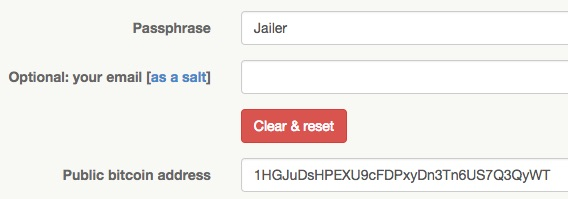
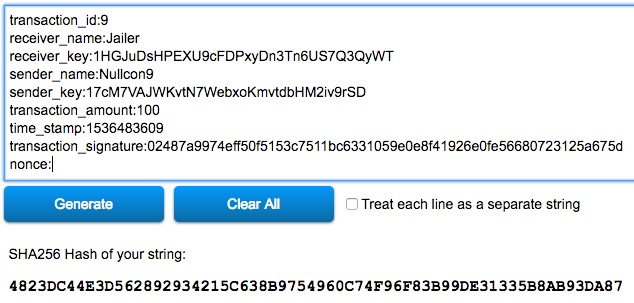

## NULLCOIN (Crypto, 300pt)

> Mine the middle
>
> [nullcoin.pdf](nullcoin.pdf)

In this challenge we have a partial transaction block that we have to complete so we get a specific SHA256 hash.

```
transaction_id:9
receiver_name:Jailer
receiver_key:?
sender_name:Nullcon9
sender_key:?
transaction_amount:100
time_stamp:1536483609 
transaction_signature:02487a9974eff50f5153c7511bc6331059e0e8f41926e0fe56680723125a675d
nonce:?
```

We can get `receiver_key` and `sender_key` using the provided [bitcoin address generator](https://keybase.io/warp), using the name as the passphrase. 



After doing the same for the `Nullcon9`, we confirm we get the same hash that is mentioned in the PDF, for the block without the nonce.



Now we only have to brute-force the nonce to get the target hash.

```python
import hashlib

block = """transaction_id:9
receiver_name:Jailer
receiver_key:1HGJuDsHPEXU9cFDPxyDn3Tn6US7Q3QyWT
sender_name:Nullcon9
sender_key:17cM7VAJWKvtN7WebxoKmvtdbHM2iv9rSD
transaction_amount:100
time_stamp:1536483609
transaction_signature:02487a9974eff50f5153c7511bc6331059e0e8f41926e0fe56680723125a675d
nonce:"""

i = 0
sig = None

while sig != "9999990b707d6d10d3121eadc054a21d1e9855f679fe1b096c05beb0273c591d":
    i = i + 1
    sig = hashlib.sha256(block + str(i)).hexdigest()

print "[+] Flag found: hackim18{{'{}'}}".format(i)

```

```bash
$ python brute-nonce.py
[+] Flag found: hackim18{'21860565'}
```
