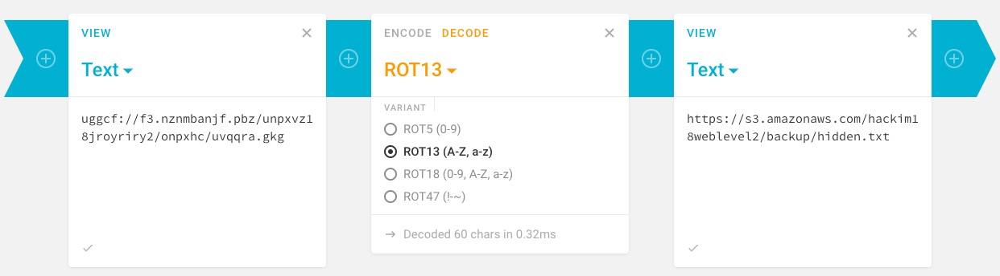

## Look skyward for the answers (Web, 300pts)

> Add host entry as "34.201.73.166 mypictureblog"

Browsing the source code of the site we spot [/assets/js/div.js](div.js).

It seems to use [JSFuck](http://www.jsfuck.com/) so we use [this decoder](https://enkhee-osiris.github.io/Decoder-JSFuck/) to get:

```js
document.getElementById('divimage').innerHTML ='';
var backup="uggcf://f3.nznmbanjf.pbz/unpxvz18jroyriry2/onpxhc/uvqqra.gkg";
```



The [hidden.txt](hidden.txt) contains a base64 encoded image, which has a base64 encoded string appended to it. This string decodes to a AWS API Gateway endpoint url.

```bash
$ curl -s "https://s3.amazonaws.com/hackim18weblevel2/backup/hidden.txt" | base64 -D | strings | grep "==" | base64 -D
https://s10e0az53f.execute-api.us-east-1.amazonaws.com/prod/hackimflagweblevel2
```

It seems that it requires an `auth` parameter, which we currently don't have.

```bash
$ curl "https://s10e0az53f.execute-api.us-east-1.amazonaws.com/prod/hackimflagweblevel2"
"{'msg':'[Missing param in querystring: auth]'}"

$ curl "https://s10e0az53f.execute-api.us-east-1.amazonaws.com/prod/hackimflagweblevel2?auth=test"
"{'msg':'Invalid auth param'}"
```

While trying to create a wordlist from the site, to brute-force the `auth` parameter, I accidentally found the correct value :P. It was inside the content of the `/` route, which did a 302 redirect to `/index.html`, after quite a lot of new lines.

```bash
$ curl -s "http://mypictureblog" | grep .
auth=bf0e14593e3e9c9392a4fe360326ab6f

$ curl "https://s10e0az53f.execute-api.us-east-1.amazonaws.com/prod/hackimflagweblevel2?auth=bf0e14593e3e9c9392a4fe360326ab6f"
"{'flag':'LaMBda-oR-NoT-tO-LAmBdA'}"
```

