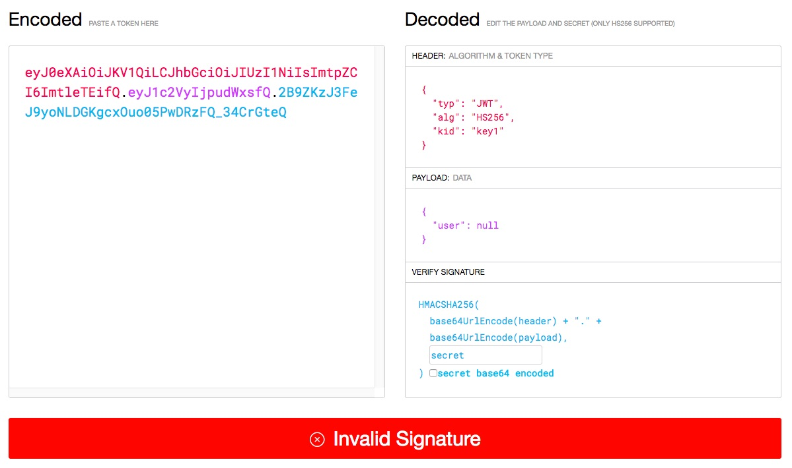
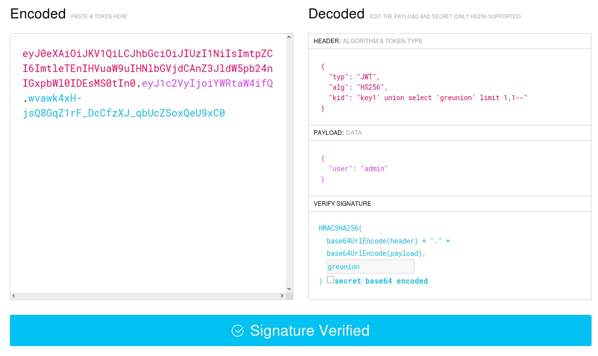
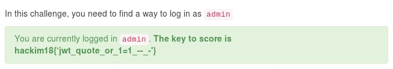

## Web6 (Web, 400pts)

> SQL injection in the kid to bypass the signature.
> 
> [http://139.59.63.144:29283/](http://139.59.63.144:29283/)

The website uses JWT for authentication. Using the debugger at [jwt.io](https://jwt.io/#debugger) we see that there is a `kid` parameter in the header section.

According to the [RFC](https://tools.ietf.org/html/rfc7515#section-4.1.4):
> The "kid" (key ID) Header Parameter is a hint indicating which key was used to secure the JWS.

In this specific implementation, given the challenge description and some initial tests, the `kid` value is used in a sql query that retrieves the key from a sqlite database and is vulnerable to injection. Using a simple union injection we can get the application to use any key we want.

Setting the new JWT as the cookie value we are logged in as `admin`.

